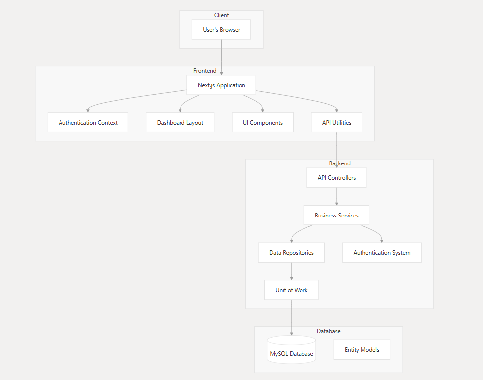
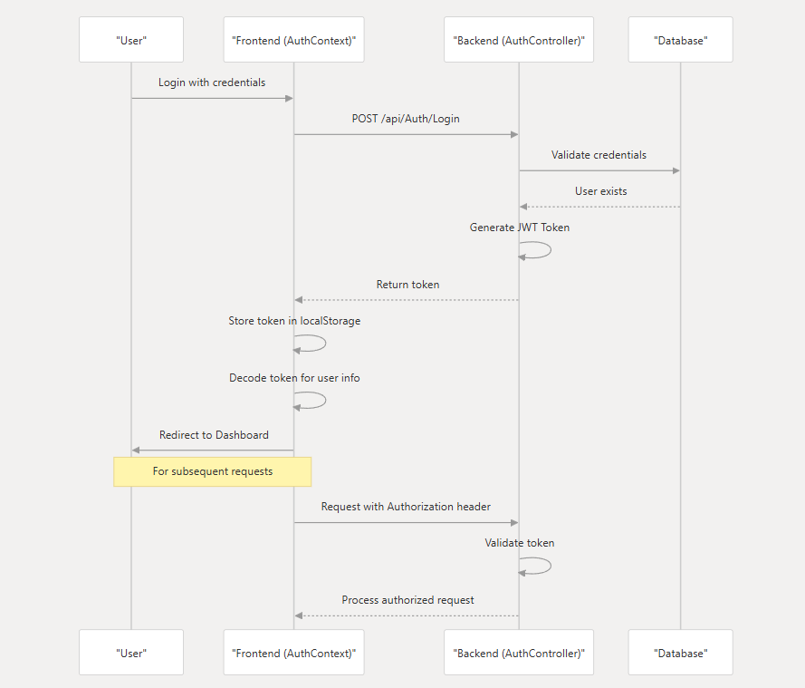
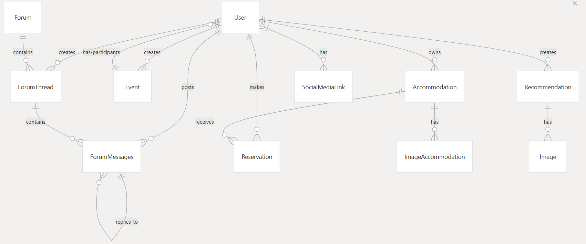
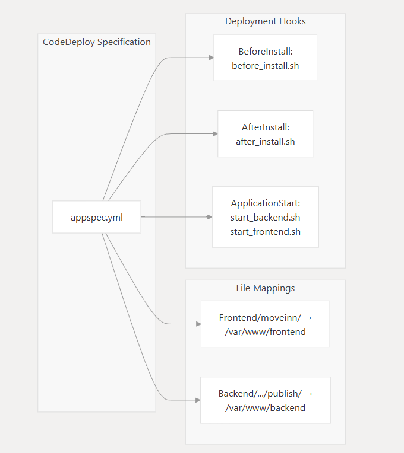
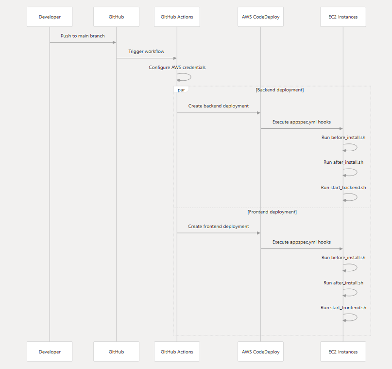
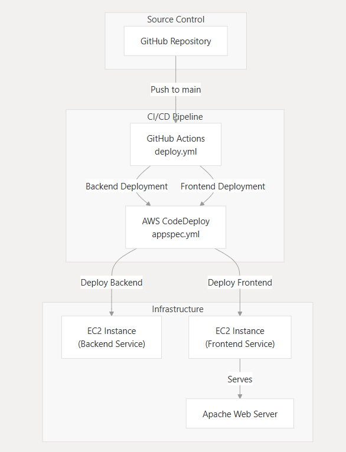

**MoveInn**
============
<a id="descripcion"></a>
## 📖 Descripcion

**MoveInn** es una red social diseñada para estudiantes Erasmus, donde podrán conectarse, compartir experiencias y facilitar la integración de nuevos participantes en sus respectivos destinos. La plataforma ofrece funcionalidades enfocadas en la convivencia, el apoyo y la socialización.

## 📑 Contenido

1. [📖 Descripción](#descripcion)  
2. [🚀 Características Principales](#caracteristicasPrincipales)  
3. [🔧 Instalación](#instalacion)  
4. [⚙️ Uso](#uso)  
5. [📚 Referencias y Documentación Frontend](#ReferenciasYDocumentacionFrontend)  
6. [🏗️ Arquitectura del Sistema](#arquitecturaDelSistema)  
7. [🔐 Flujo de Autenticación](#flujoDeAutenticacion)  
8. [🗃️ Modelos de Datos y Relaciones](#modeloDeDatosYRelaciones)  
9. [☁️ Despliegue en AWS](#despliegueEnAws)  
10. [📌 Autores](#autores)  
11. [📄 Licencia](#licencia) 

<a id="caracteristicasPrincipales"></a>
## 🚀 Características Principales

- Perfil de arrendadores y publicación de habitaciones en alquiler.  
- Anfitriones Erasmus con sistema de ayuda y orientación.  
- Organización de quedadas y eventos con control de asistentes.  
- Chat directo entre usuarios.  
- Foros de discusión sobre trámites, cultura y experiencias.  
- Recomendaciones y valoraciones de lugares de interés.  
- Perfiles de estudiantes con sistema seguimiento y mensajería.  

_La arquitectura se basa en un cliente Next.js que consume una API RESTful desarrollada en ASP.NET, con persistencia en SQLite y despliegue continuo en AWS._

<a id="instalacion"></a>
## 🔧 Instalación


### 📝 Prerrequisitos

|    | Requisito       | Versión |
|----|-----------------|---------|
|  | **Node.js**   | v16+    |
|  | **.NET SDK**  | 6.0+    |
|  | **SQLite**    | –       |
|  | **Cuenta AWS** | –       |


### Clonar el repositorio

```bash
git clone https://github.com/Chriistiiaann/MoveInn
cd moveinn
```

### Configurar y arrancar el Backend

```bash
cd backend
dotnet restore
dotnet run
```

### Configurar y arrancar el Frontend

```bash
cd frontend
npm install
npm run dev
```
<a id="uso"></a>
## ⚙️ Uso

Para familiarizarte rápidamente con **MoveInn**, puedes comenzar viendo nuestro vídeo de presentación justo aquí:

[](https://www.youtube.com/watch?v=K4JG6JG6JG6)  
> ▶️ [Ver en YouTube](https://www.youtube.com/watch?v=K4JG6JG6JG6)

A continuación, sigue estos pasos para empezar a disfrutar de la plataforma:

1. **Accede a la aplicación**  
   - **Local**: abre `http://localhost:3000` en tu navegador.  
   - **Desplegada**: abre `https://moveinn.duckdns.org`.

2. **Regístrate o inicia sesión**  
   - Haz clic en **Registrarse** si eres nuevo usuario.  
   - Haz clic en **Iniciar sesión** si ya tienes cuenta.  
   - Introduce tu correo y contraseña para entrar en tu panel.

3. **Explora las funcionalidades**  
   - 🗣️ **Foros**: publica y responde preguntas sobre trámites, cultura y experiencias.  
   - 📅 **Eventos**: consulta, crea y únete a quedadas en tu destino.  
   - ⭐ **Recomendaciones**: descubre y valora restaurantes, cafeterías y lugares de interés.  
   - 🏠 **Alojamientos**: busca, filtra y publica habitaciones en alquiler.  
   - 🎓 **Hosts**: ponte en contacto con anfitriones para recibir ayuda y consejos locales.  
   - 👤 **Perfiles de usuario**: visita los perfiles de otros estudiantes para conocer sus intereses y experiencias.  
   - 💬 **Chat**: conversa en tiempo real con tus compañeros y anfitriones.

4. **¡A disfrutar de MoveInn!**  
   Conecta con la comunidad Erasmus, comparte tus vivencias y haz que tu estancia sea inolvidable.  

<a id="ReferenciasYDocumentacionFrontend"></a>
## 📚 Referencias y Documentación Frontend

### 📘 Bibliografía
- [Documentación oficial de ASP.NET Core 8](https://learn.microsoft.com/aspnet/core/?view=aspnetcore-8.0)  
- [Next.js Documentation](https://nextjs.org/docs)  
- [Tailwind CSS Documentation](https://tailwindcss.com/docs)  

### 📒 Bitácora y anteproyecto
- [Ver la bitácora de desarrollo y el anteproyecto en Notion](https://www.notion.so/Anteproyecto-1bf05cb0a24980b5a008c85d3963479d)  

### 🎨 Diseño y Documentación Frontend
- [Prototipos en Figma](https://www.figma.com/design/Fk9dHAUrLTsE9YpQ6nX2WV/MoveInn?node-id=0-1&t=hEjniRgTCOvDUPk0-1)  
- [Documentación Frontend](https://docs.google.com/document/d/1sNPZV_LL11qH76SVsSsHjmcT2MHdQJ64DWNDYb_xRQQ/edit?usp=sharing)  

<a id="arquitecturaDelSistema"></a>
## 🏗️ Arquitectura del Sistema



La aplicación sigue una arquitectura **cliente-servidor** con separación de responsabilidades:

### 📦 Base de Datos
- **MySQL**: almacena usuarios, alojamientos, eventos, foros y recomendaciones.  
- **Entity Models**: reflejan el dominio de negocio y sus relaciones.

### 🖥️ Backend
- **ASP.NET Core**  
  - **Controllers**: exponen los endpoints RESTful.  
  - **Business Services**: implementan la lógica de negocio.  
  - **Data Repositories + Unit of Work**: gestionan el acceso a datos vía Entity Framework Core.

### 🎨 Frontend
- **Next.js**  
  - **UI Components** (_Navbar_, _HeroSection_, _Dashboard Layout_, …).  
  - **API Utilities**: wrappers para llamar a la API.  
  - **Auth Context**: mantiene el estado de usuario y el JWT.  
  - **Layouts y Rutas**: vistas responsivas y navegación.

### 🌐 Cliente
- **Navegador**: ejecuta la SPA, almacena el JWT en `localStorage` y lo envía en el header `Authorization`.

---

<a id="flujoDeAutenticacion"></a>
## 🔐 Flujo de Autenticación



1. **Usuario** envía credenciales a `POST /api/Auth/Login`.  
2. **AuthController** valida en la **base de datos**.  
3. Se genera un **JWT** y se devuelve al frontend.  
4. El frontend lo almacena en `localStorage` y decodifica para extraer info de usuario.  
5. Redirige al **Dashboard**.  
6. En peticiones posteriores, el header `Authorization: Bearer <token>` permite al backend validar y autorizar.

---

<a id="modeloDeDatosYRelaciones"></a>
## 🗃️ Modelos de Datos y Relaciones



- **User**  
  - Publica → `Accommodation`, `Event`, `Recommendation`, `ForumThread`, `ForumMessage`.  
  - Reserva → `Reservation`.  
  - Conecta (amistad, chat) con otros usuarios.  
  - Tiene → `SocialMediaLink`.

- **Accommodation**  
  - Pertenece a 1 **User** (propietario).  
  - Contiene → `ImageAccommodation` → `Image`.

- **Event**  
  - Crea 1 **User**.  
  - Participan varios **Users**.

- **Recommendation**  
  - Crea 1 **User**.  
  - Adjunto → `Image`.

- **ForumThread** / **ForumMessage**  
  - Hilo y respuestas creados por **Users**.  
  - `ForumMessages` puede responder a otro mensaje.

- **Reservation**  
  - Relación N–M entre **User** y **Accommodation**.

<a id="despliegueEnAws"></a>
## ☁️ Despliegue en AWS

En esta sección se detalla cómo se despliega **MoveInn** desde GitHub hasta las instancias EC2 en AWS, usando GitHub Actions y AWS CodeDeploy.

---

### 🏗️ Arquitectura del Servicio


1. **EC2 Instances**: instancias Linux en AWS que alojan los servicios.  
2. **backend.service**: servicio systemd para la API .NET.  
3. **frontend.service**: servicio systemd para la aplicación Next.js.  
4. **Apache Web Server**: expone el contenido del frontend en `/var/www/frontend/`.  
5. **Estructura de ficheros** bajo `/var/www/`:
   ```bash
   /var/www/
   ├─ backend/    ← código publicado del backend
   └─ frontend/   ← build estático del frontend
   ```

### 🔑 Componentes Clave de CodeDeploy



- **appspec.yml**: define los mapeos de archivos y los hooks de despliegue.  
- **Deployment Hooks**: etapas (BeforeInstall, AfterInstall, ApplicationStart) en las que se ejecutan los scripts de preparación, ajuste de permisos e inicio de servicios.  
- **File Mappings**: rutas origen → destino en las instancias EC2.

---

### 🚀 Flujo de Despliegue



1. El desarrollador hace **push** a `main`.  
2. **GitHub Actions** dispara el workflow de despliegue (`deploy.yml`).  
3. Se crean dos despliegues en CodeDeploy (backend y frontend).  
4. CodeDeploy ejecuta los hooks correspondientes en cada instancia EC2.  
5. Los servicios systemd (`backend.service`, `frontend.service`) arrancan o se actualizan automáticamente.

---

### ⚙️ Arquitectura CI/CD



El pipeline sigue este flujo:

1. **Source Control**: GitHub Repository → push a `main`.  
2. **CI/CD Pipeline**: GitHub Actions (`.github/workflows/deploy.yml`)  
- Jobs: `configure-aws`, `deploy-backend`, `deploy-frontend`.  
3. **AWS CodeDeploy**: appspec.yml gestiona la fase de despliegue.  
4. **Infrastructure**: dos instancias EC2 (backend y frontend) detrás de Apache.

<a id="autores"></a>
## 📌 Autores

- [Christian Rodríguez Lara](https://github.com/Chriistiiaann)  
- [Kilian Méndez Ávila](https://github.com/kilianmendez)  
- [Yasir Bel Maalem](https://github.com/yasirrdev) 

<a id="licencia"></a>
## 📄 Licencia

Este proyecto está protegido por derechos de autor. No se permite su uso, copia, modificación, distribución ni creación de obras derivadas sin autorización expresa de los autores.

© 2025 [Christian Rodríguez Lara](https://github.com/Chriistiiaann), [Kilian Méndez Ávila](https://github.com/kilianmendez), [Yasir Bel Maalem](https://github.com/yasirrdev). Todos los derechos reservados.